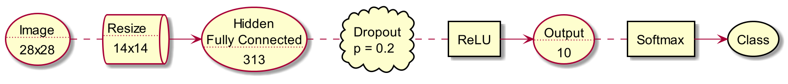
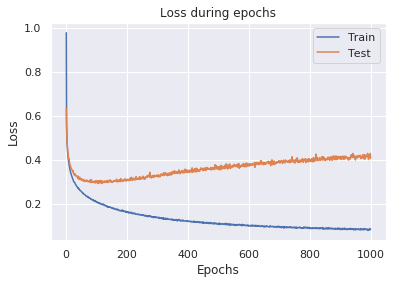
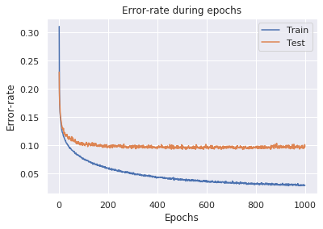

= Fully connected Neural Network vs. Fashion MNIST
Shahar Rotem; Afik Bar
:doctype: article
:encoding: utf-8
:lang: en
:!toc:
:!numbered:

== Data
The dataset contains 70,000 examples of `28x28` grayscale images. +
Each example is labeled with a single class from: `[T-shirt/top, Trouser, Pullover, Dress, Coat, Sandal, Shirt, Sneaker, Bag, Ankle boot]`.

== Preprocessing
Under the limitation of `65,000` trainable parameters, and since our input size is `28x28`, the first hidden layer size is can't be more than `82` neurons.

Therefore, we've decided to scale-down the images to `14x14`. +
Another mandatory preproccessing was scaling `[0,255]` -> `[0,1]`, and flattening.

== Model Architecture
Our neural network consist of a single fully connected hidden layer, with `313` neurons.

.Model Architecture

////
[uml,file="uml-example.png"]
--

queue Resize [
Resize
....
14x14
]

usecase Input [
Image
....
28x28
]

usecase FC [
Hidden
Fully Connected
....
313
]

rectangle ReLU

cloud Dropout[
Dropout
p = 0.2
]

usecase Output [
Output
....
10
]

rectangle Softmax
storage Class

Input . Resize
Resize -> FC
FC . Dropout
Dropout . ReLU
ReLU -> Output
Output . Softmax
Softmax -> Class
--
////

== Training
We created a script to test multiple combinations of different parameters and architectures.

The following setup was chosen:

=== Hyper parameters
- Epochs : `1000`
- Batch size : `512`
- Learning rate : `0.001`
- Dropout Probability : `0.2`
- AdamW Weight decay : `0.01`

=== Optimizer
We've tried several different optimizers, with different configurations, and found out that Adam-Weighted performed slightly better.

=== Additional attempts
We've tried multiple transformations to the images, and found no improvement:

- Random image rotation
- Random image flip
- Random partial crop
- Normalizing with train mean & standard deviation
- Normalizing each batch with batch mean & standard deviation

== Results
We were able to reach an accuracy of `90.93` on the test set.

== Conclusions
Under the limitations of the problem, our model is more similar to a Perceptron than a common Neural Net.

Following this thought, we used the default number of epochs for Perceptron (`1000`). +
To avoid complete over-fit, we've used Dropout, which helped to obtain a better generalization.

== Convergence
.Loss during epochs

.Error during epochs

