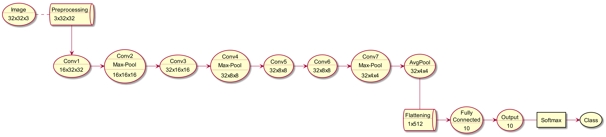

= Convolutional Neural Network vs. CIFAR10
Shahar Rotem 206485898; Afik Bar 311121289
:doctype: article
:encoding: utf-8
:lang: en
:!toc:
:!numbered:

Shahar Rotem +
Afik Bar

== Data
The dataset contains 60,000 examples of `32x32` color images. +
Each example is labeled with a single class from: `[Airplane, Automobile, Bird, Cat, Deer, Dog, Frog, Horse, Ship, Truck]`. +
Each class has 6,000 examples.

== Preprocessing

To obtain better generalization, we've used several transformations:

- Random Cropping
- Random Horizontal Flipping
- Random Rotation

Another mandatory preproccessing was normalizing each color channel.

== Model Architecture
Our neural network consists of 7 convolutional layers with batch normalization & ReLU as activation function, 1 average pool, and 1 fully connected layers.

[.left]
.Model Architecture

////
[uml,file="img/uml.png"]
--

queue Transform [
Preprocessing
....
3x32x32   
]

usecase Input [
Image
....
32x32x3
]

usecase Conv1 [
Conv1
....
16x32x32
]

usecase Conv2 [
Conv2
....
Max-Pool
....
16x16x16
]

usecase Conv3 [
Conv3
....
32x16x16
]

usecase Conv4 [
Conv4
....
Max-Pool
....
32x8x8
]

usecase Conv5 [
Conv5
....
32x8x8
]

usecase Conv6 [
Conv6
....
32x8x8
]

usecase Conv7 [
Conv7
....
Max-Pool
....
32x4x4
]

usecase AvgPool [
AvgPool
....
32x4x4
]

queue Flat [
Flattening
....
1x512 
]

usecase FC [
Fully
Connected
....
10
]

usecase Output [
Output
....
10
]

rectangle Softmax
storage Class

Input . Transform
Transform --> Conv1
Conv1 -> Conv2
Conv2 -> Conv3
Conv3 -> Conv4
Conv4 -> Conv5
Conv5 -> Conv6
Conv6 -> Conv7
Conv7 -> AvgPool
AvgPool -- Flat
Flat -> FC
FC -> Output
Output - Softmax
Softmax -> Class
--
////

== Training
We tried to approximate a VGG net, by testing multiple convolutional layers size & depth. +
We've also tried different positions (and kernel sizes) of Max-Pooling layers. +
We found out that Dropout consistently preformed worse (Possibly due to Batch normalization).

The following setup was chosen:

==== Hyper parameters
- Epochs : `2000`
- Batch size : `64`
- Learning rate : `0.001`
- AdamW Weight decay : `0.01`

==== Optimizer
We've tried several different optimizers, with different configurations, and found out that Adam-Weighted performed slightly better, with default decay & learning rate.

=== Additional attempts
We've tried multiple data augmentations to the images, and found that they greatly influenced the results. +
Augmentations that we've tested:

- Random image rotation
- Random image flip (Horizontal & Vertical)
- Random partial crop / Random resized crop
- Resizing
- Normalizing with train mean & standard deviation
- Normalizing each batch with batch mean & standard deviation

== Results
We were able to reach an accuracy of `88.18` on the test set.

== Conclusions
We found out that architecture changes had slight improvements over the data, and most of the improvements resulted from data augmentation, and enough epochs.  

== Convergence

[.left]
.Loss during epochs
image::img/loss.jpg[,70%]

[.left]
.Error during epochs
image::img/error.jpg[,70%]
