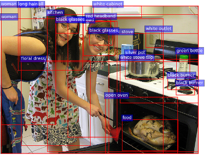
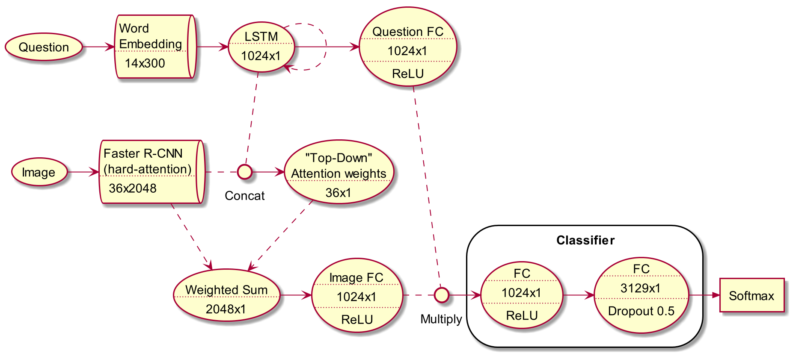
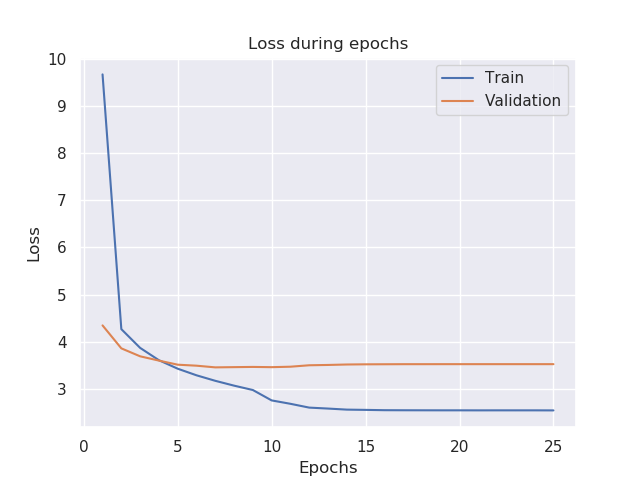
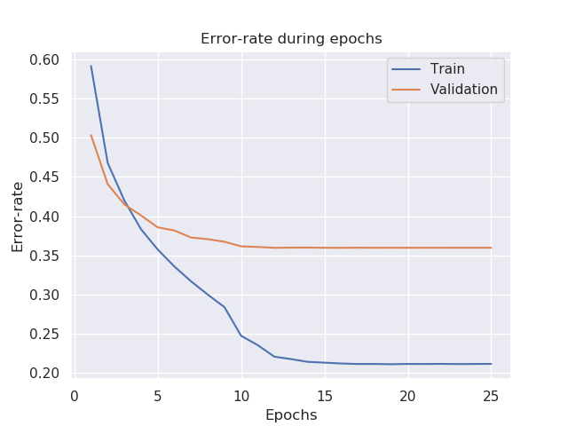

= Attention vs. VQA v2.0
Shahar Rotem 206485898; Afik Bar 311121289
:doctype: article
:encoding: utf-8
:lang: en
:!toc:
:!numbered:

Shahar Rotem +
Afik Bar

== Data
The dataset contains `12,3287` images (MSCOCO) and `658,111` questions (approx. `5.4` questions per image), with 10 ground truth answers per question.

== TL;DR
Throughout the project, we've used https://arxiv.org/pdf/1707.07998.pdf[Bottom-Up and Top-Down Attention for Image Captioning and Visual Question Answering] as a "guide".

We were able to slightly improve their best result over Validation set from `63.2%` -> `64.04%`.

== Features extraction
Preprocessing was divided into two problems, Images features extraction & Text features extraction.

=== Image features extraction
Images were processed using "`Faster R-CNN bottom-up attention`" model (see section 3.1 of https://arxiv.org/pdf/1707.07998.pdf[article]).

We've used a pretrained model over `ImageNet` & `Visual Genome` data, to obtain good feature representations.

This model functions as '`hard`' attention mechanism, since we only select `36` image bounding box features.

We've selected `36` features to greatly improve execution time over little accuracy loss. (Article used 10 to 100 features, according to some thresholding)

The final extracted features dimensions are: `[N x 36 x 2048]`.

.Extracted features example. (Our model outputs a vector of `2048` for each feature, instead of captioning)

=== Text features extraction
We've embedded each question using 300 dimension word embeddings, initialized with https://nlp.stanford.edu/projects/glove/[GloVe].

We've used 1-layered LSTM hidden layer as features with dimension of `1024`, to obtain better textual expressiveness (Article used 512).

== Model Architecture
Our Multimodal network implements a joint embedding of the questions and images, followed by a multi-label (`3,129` possible answers) classifier.

[NOTE]
====
3,129 possible answers are answers that appeared more than 8 time in training set. using only these answers, the maximum accuracy possible on the validation set is `88.9%`.
====

.Model Architecture

////
[uml,file="img/uml.png"]
----

queue word_embed [
Word 
Embedding
....
14x300
]

queue Atten1 [
Faster R-CNN
(hard-attention)
....
36x2048
]

usecase Image
usecase Question

usecase LSTM [
LSTM
....
1024x1 
]

usecase Atten2 [
"Top-Down" 
Attention weights
....
36x1
]

interface Concat

usecase Sum1 [
Weighted Sum
....
2048x1
]

usecase FC1v [
Image FC
....
1024x1
....
ReLU
]

usecase FC1q [
Question FC
....
1024x1
....
ReLU
]

storage Classifier {

usecase FC2 [
FC
....
1024x1
....
ReLU
]

usecase FC3 [
FC
....
3129x1
....
Dropout 0.5
]
}

interface Multiply

agent Softmax

Question -> word_embed
word_embed -> LSTM
LSTM ..> LSTM
LSTM .. Concat

Image -> Atten1
Atten1 . Concat

Concat -> Atten2

Atten2 ..> Sum1
Atten1 ..> Sum1

Sum1 -> FC1v
LSTM -> FC1q
 

FC1v . Multiply
FC1q . Multiply

Multiply -> FC2
FC2 -> FC3
FC3 ->> Softmax

----
////

== Training
We've used the experiments section in the article, and adjusted few parameters to achieve better performance.

Adjusted settings:

* constant number of features to represent an image (`36`).
* Increased question embedding to `1024`, to achieve better textual expressiveness.
* Added fully connected layers to question and image, before classification.

== Results
We were able to reach an accuracy of `64.03%` on the validation set.

== Conclusions
Since each modifications took very long to test whether are effective or not, we didn't trial & error as much we would want to.

Feature extraction greatly affect both performance and execution time.

We noticed that in every attempt of settings, the first few epochs provided better results on validation set then the training set (see <<error_rate>>). +
We suspect this might due to non-randomized split between train & validation.

We didn't play around with attention mechanism at all, which we suspect might impact on results.

== Convergence

[.left]
.Loss during epochs

[.left]
[[error_rate]]
.Error during epochs

